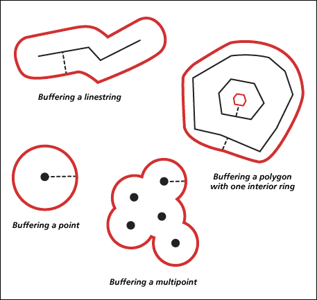

```{r setup, include=FALSE}     
knitr::opts_chunk$set(echo = TRUE)
```


# SECTION 1: Introduction

  - Who's who?

  - What's the D-Lab?
    
  - WORKSHOP GOALS:
     - Learn the first principles of geospatial information systems (GIS)
     - Learn how GIS can be used for historical social science
     - Practice some basics of reading in, manipulating, analyzing, and mapping geospatial data

  - FUNDAMENTALS:
    Some of you may be brand spankin' new to R
    If that's the case, today might be a whirlwind for you, but please ask questions! (No shame.)
    I will do my best to explain things as I go, while also keeping time constraints in mind
    Also, here's a good starting R tutorial from our Stats Dept: http://www.stat.berkeley.edu/~spector/R.pdf

###**Geospatial data** is any data, whatever the form, that includes data associating it with its proper location on the face of the earth.


###Typically, this is expressed using **coordinate pairs** indicating the position of each point in the dataset. 


###Coordinates can be:
 - __Geographic__: expressed as angles in two dimensions that determine points on a globe, usually using **latitude** and **longitude**; a.k.a. **unprojected coordinates**

 - __Cartesian__: expressed as points on a Cartesian plane (i.e. x and y axes), after the globe's surface has been **projected** onto the plane; a.k.a. **projected coordinates** (more on this in a bit)

</img>


Note that, depending where you read, there are others, but the distinction between these two types is fundamentally important.

-----------------------

###Geographic coordinates are typically thought of as referring to a location on a **spheroid** or **ellipsoid**,
which serves as a mathematical model (approximation) of the true, lumpy **geoid** that is our planet.

</img>

--------------

###Ellipsoids are used to define **Coordinate reference systems (CRS)**

Because strict spheroids and ellipsoids do not allow for important local variations in elevation, they are
used as the bases for the the defintion of various **geodetic datums**, which then serve as the mathematical
models that provide the reference points against which coordinates can be expressed. Thus, the
spheroid/ellipsoid and geodetic datum two of the main components we must consider when working the **coordinate
reference systems** (CRS) of our datasets.

We then use the CRS as the basis against which any point on the earth's surface can be positioned.

Here is an example of a common type of CRS, called **Universal Transverse Mercator** (UTM).
Some of the data we'll work with will be in UTM.

</img>

----------------

###Many CRS use a **projection**
  A **projection** is a scheme for representing the globe's surface on a flat plane.

  Literally imagine placing the global inside a cylinder (a cylindrical projection) or a cone
  (conical projection), for example, then putting a light inside it (jack-o-lantern-style), and capturing 
  the image on the cylinder, cone, what-have-you, and then cutting it and unfolfing it flat.
 
</img>

  As you can probably imagine, different datasets in different projections don't jive all that well.

  Also, it is important to be aware: It is shown impossible to devise a projection that maintains 
  the true areas, sizes, angular relations, and shapes of geographic entities (i.e. 'something's gotta give').
  So when choosing projections we often want to consider which of these are most important to preserve 
  for our purposes (i.e. do we want an equal-area projection? an equal-angle projection? etc.)

  This spawns some pretty passionate opinions about map projections:

</img>

----------------

###Geospatial data typically is stored in one of two common ways:

  **Vector**: points, lines, or polygons (or sets of these) can be expressed as connected series of points;
  the number of points used per real-world distance will determine the resolution of this representation (and
  thus, the level of detail, or **resolution** with which we are representing the real-world complexity of a geographic
  feature (consider, for example, that the most accurate map of the CA coast would be a 1:1 scaled replica of
  the coast, i.e. the coast itself...). 
  
</img>

  ####Basically, think of a ___'connect-the-dots'___ model.


  **Raster**: continuously spatially distributed variables are often represented by gridded cells, each having 
  a location (which can be defined as the coordinates of its center, or of its lower-left corner, etcetera) 
  and at least one value (for the variable(s) of interest). Cells will have a fixed cell-size (typically
  expressed as the real-world distance represented by a cell-side, in either distance or degrees), and this
  cell-size will determine the **resolution** (i.e. level of detail) with which we represent the real-world
  complexity of this variable. 
  
</img>

  ####Basically, think of a ___'color-by-number'___ model.

  (Indeed, digital photos are commonly saved as rasters, usually with each cell having 3 values, 
  for red, green, and blue.)


###You can probably imagine that any real-world geographic entity could be represented in either of these two ways.

</img>

  In some use-cases, one type simply makes a lot more sense than the other (e.g. temperature is usually a
  raster, jursdictional boundaries are usually vectors). 

  In other cases, it may actually depend on the **scale** of the analysis (e.g. it might make sense to think of
  a road as vector at the scale of a city, but as a raster at the scale of a neighborhood).


---------------------------


###Lastly, we can use geospatial data to conduct all kinds of **spatial analysis**

  Here is a smattering of examples of common **spatial analysis** methods. By no means comprehensive, but to
  give you a taste. (And this includes some operations that we will use in our workshop today.)

- **Overlays**

</img>

- **Intersections**

</img>

- **Buffers**

</img>

- **Clipping**

</img>

- **Raster Algebra**

</img>

- **Spatial simulations**

</img>

- **Spatial statistics** (there are many)

</img>

- **Digitization** (_great potential for historical social science!_)

</img>


-----------------------------------

###Okay, that was a VERY brief run-down. 
This should all make more sense as we start to play with actual data.

Most of the data we will be working with is vector data, but we'll also briefly see some raster data at the end.  

Here goes!...

----------------------


----------------------------

#SECTION 2: PREPARATION


Let's start off with some good boilerplate code for getting everyone's workspace, working directory, and packages set up
(Gleaned from Shinhye Choi's and Patty Frontiera's spatial-R workshop, which you should register for if you'd
be interested in learning more after today's material! Check http://gif.berkeley.edu/support/workshops.html
for scheduling of this and other workshops.)

**NOTE**: Be sure to replace _my_ working directory with the path to _yours_! 

```{r libraries, include = TRUE}
#clear workspace
rm(list = ls())

#set your working directory
#setwd("/home/ihavehands/Hidden_Desktop/berk/my_workshops/r_spatial/") #NOTE: REPLACE WITH YOUR LOCAL DIRECTORY

#check for packages, install those you don't already have
required.pkg <- c('utils', 'raster', 'sp', 'maptools', 'readxl', 'dismo', 'rgeos')   #NOTE: LIST ALL PACKAGES HERE
#required.pkg <- c('utils', 'raster', 'rgdal', 'sp', 'maptools', 'readxl', 'dismo', 'rgeos')   #NOTE: LIST ALL PACKAGES HERE
pkgs.not.installed <- required.pkg[!sapply(required.pkg, function(p) require(p, character.only=T))]
install.packages(pkgs.not.installed, dependencies=TRUE)

# Now load all libraries 
lapply(required.pkg, library, character.only = TRUE)         
```

Now we'll download the data for today's examples.

Use your browser to navigate to https://www.dropbox.com/sh/avo94zu7nijgxw2/AAAkFrVMIeOTwGjnrhwsXjHVa?dl=0 and
download and unzip the archive of all of the data located there. 

Please be sure to unzip this into the directory of the Github repository that you already downloaded and unzipped. 
This will serve as your 'working directory' (i.e. the main directory you'll be accessing from R).


-------------------------------


#SECTION 3: MAPPING DELL (2010)

###First, let's read in the shapefiles we want 

These are the modern Peru border and the Mita region border.

First, we'll need to stipulate the **CRS** and **projection** of these data. We can do this by providing the
correct arguments in the form of a `proj4string`,
which is a common standard used for defining projections.

```{r}
    #set the correct proj4string for the Mita and Peru data
    #(you can get this information from your metadata, or from reading your dataset into ArcGIS or QGIS and inspecting, or from GDAL's command line tools, among other ways)
  mita_and_peru_proj4 = CRS("+proj=utm +zone=18 +south +ellps=WGS84 +datum=WGS84 +units=m +no_defs")
```

And now we can read in the data!

```{r}
  #read in the Mita border (this is a bunch of lines)
    # DATA SOURCE:  http://scholar.harvard.edu/files/dell/files/ecta8121_0.pdf
  mita = readShapeLines('./Dell_raw_data_files/MitaBoundary.shp', proj4string = mita_and_peru_proj4)
  
  
  #and read in the Peru map (this is a group of polygons)
  peru = readShapePoly('./Dell_raw_data_files/peru_nw.shp', proj4string = mita_and_peru_proj4)
```

Now, what do these things that we just read in look like? 
What's in them? 

--------------------

###Let's explore them a bit:


```{r}
  mita
```

This just prints the mita object to your console (i.e. as 'standard output', or STDOUT in programmer shorthand jargon)


Now, try typing `mita$` and then hitting `<Tab>`

This should display the column names in `mita`'s'SpatialLinesDataFrame'
\$ is a common symbol used for getting the columns out of a data.frame (more on the data.frame class in a bit...)

This ability to use <Tab> to display possible completions of code you're typing is called, fittingly,
**tab-completion**.

Now try tab-completing `mita@`.

This returns the components of an S4 object.
R has both S3 and S4 objects (and also the less rarely seen R5 objects)
**Objects** are instantiations of **classes**, which are 
data-structures used to represent a certain 'real thing' (e.g. PDF, animal, shapefile, etc.),
and whose hierarchically structured contents are canonically defined by the code living in a script in
base R or in a package.

Now we'll use this knowledge to pull things out of the `mita` object:

```{r}
  #get the lines component
  mita_line = mita@lines
 
  #And what is the type of this component?
  typeof(mita@lines) 

  #Because it's a list, we'll use double-brackets to index things out of it:
  mita_line_first = mita@lines[[1]]

  #NOTE: Not displaying these things in the RMarkdown document because they're LONG! But feel free
  #to print them out to your terminal!

  #and what is the type of this component?
  typeof(mita_line_first) 

  #now we can tab-complete to explore this, as so on...
```

  So you can see how this is a highly structured data object, used to store 
  all of the bits and pieces we need in order to characterize our geospatial lines

  Also, super-helpfully, we can get a really good look at its (or any object's) structure, 
  almost as a roadmap of how to index into it and access the information we want:


```{r}
str(mita)
```

  The method we've been using is an excellent way to 'dig into' the structure and organization of any
  object that you're reading in with any R package, in order to start making sense of how it's arranged
  and what lives where. Good to get in the habit.
  
  You can of course also read the docs, which should always stipulate the value (i.e. type, and its
  characteristics and constraints) of the output of a function.
  But, often they're long, complicated, and make your eyes glaze over.
  So both approaches are important sources of info, but this is a bit more interactive and intuitive.
  
  
Now it's time for you to try!
  **Try to get down to the actual coordinate pairs, and extract the first 100:**


  **[PRACTICE TIME!]**
.

.

.

.

.

.

.

.

.

.

.

.

.

.

.

.

.

.


###SPOILER ALERT: Answer below:
.

.

.

.

.


Here's the answer:

```{r}
  mita@lines[[1]]@Lines[[1]]@coords[1:100,]
```

  And as it turns out, there is a **method** (i.e. a function built into an object of a certain class)
  that will return the coordinates for an object. For the future, this obviates the
  complicated syntax that we just typed. Here's the answer using that instead:

```{r}
  coordinates(mita)[[1]][[1]][1:100,]
```

--------------------

###Now, let's plot some of our geospatial data!

  We can plot our first hundred coordinates as points:

```{r}
  plot(mita@lines[[1]]@Lines[[1]]@coords[1:100,]) #as points
```

  Or as lines:

```{r} 
plot(mita@lines[[1]]@Lines[[1]]@coords[1:100,], type = 'l') # as lines
```


  Now, if we were to poke around for a bit in the `peru` object, we would see that some of the lines' 
  coordinate arrays have the same coordinate pair in the first and last row. 
  What does this mean?...


```{r}
  plot(peru@polygons[[1]]@Polygons[[819]]@coords, type = 'l')
```

  Makes sense! :) 
  This should help shed light on why points, lines, and polygons are all cases of **vector data**.
  Also, you should now be able to easily imagine how you could use this approach to save polygons, polylines, 
  polypolygons (called multipolygons)... and of course points!


--------------------

#Now let's map our shapefiles!

  It should be clear by now that this amounts to nothing more than *plotting* them, just as we would 
  plot any other two-dimensional data, but with our x and y dimensions being determined by our CRS.


  Here's a quick-and-dirty map (border in black, Mita region in red)

  ```{r}
  plot(peru)
  plot(mita, col = 'red')
  ```

  Wait! They didn't plot together. Annoying! Try this:

  ```{r}
  plot(peru)
  lines(mita, col = 'red')
  ```
  
  Or alternatively, try this!

```{r}
plot(peru)
plot(mita, col = 'red', add = TRUE)
```

  Neat, eh!? Straightforward enough, I hope?

  _**Questions?**_


 
--------------------

###Now let's add another data-source: the point locations of all district capitals

  We'll start by reading in the XLS file containing the district capitals as a data.frame.
  We can do this using the `readxl` package.

```{r}
  caps = read_excel('./Dell_raw_data_files/locations.xlsx')
```

  Remember that we saw a SpatialLinesDataFrame before? And we mentioned the data.frame class?
  Let's chat a bit more about the **`data.frame` class**:


  A data.frame can be thought of in a number of ways:
    
  1. The programmatic equivalent of spreadsheet
     _(The obvious way, and the intended use)_
    
  2. An array in which different datatypes are allowed in each column 
     _(The inutitive way, but not actually how it's implemented)_

  3. A list of data vectors, with each vector (i.e. column) having a name and being constrained to the same length
     _(This is in fact how the data.frame class is implemented; being aware of this can sometimes be helpful.)_

```{r} 
  class(caps)
```

  We can see that, because we used the readxl package to read it in, our file was read in as a **derived class** defined by
  that package (`tbl.df`)
  
  Let's convert it to just a plan ol' data.frame (to avoid problems downstream):

```{r}
  caps = as.data.frame(caps)
  class(caps)
```

  Data frames are the bailiwick of R, and have a ton of **methods** (*remember what this means?*)
  and other functionalities (especially through other very useful packages, e.g. `plyr`, `reshape2`) 
  that will make your data work all-powerful. *If you will be working in R, definitely spend some 
  time learning more about and practicing working with `data.frame`s!


--------------------

### Now we can map our points on top of our lines and polygons  

  We were able to read these points in as a data frame like this, without any fancy packages, because R is
  currently unaware that these are geospatial data. In other words, our latitude and longitude columns are just two of a
  number of columns of data that just happen to be numerics. 
  
  Clearly, this wouldn't work (or would be very messy and complicated) with line or polygon data,
  because in each row, instead of a value for lat and a value for lon, we would need a vector 
  (or a vector of vectors of vectors...) of points! 

  But it works fine for points, which is why storage in XLS (or **CSV**, i.e. comma-separated values, more simply) 
  is typical. 
  
  However, we can't just read in the data and run, as this would create a problem:

```{r}
  plot(peru)
  points(caps$lon, caps$lat, col = 'blue')  #PRO-TIP: Remember that lon is x, lat is y!
```

  Where the heck are our points?
  
  Oh, they're __way__ the heck out there...

  ```{r}
  #Get min and max lat and lon values
  x_min = min(min(caps$lon), min(sapply(peru@polygons[[1]]@Polygons, function(x)min(x@coords[,1]))))-100
  y_min = min(min(caps$lat), min(sapply(peru@polygons[[1]]@Polygons, function(x)min(x@coords[,2]))))-100
  x_max = max(max(caps$lon), max(sapply(peru@polygons[[1]]@Polygons, function(x)max(x@coords[,1]))))+100
  y_max = max(max(caps$lat), max(sapply(peru@polygons[[1]]@Polygons, function(x)max(x@coords[,2]))))+100

  #Plot data again, this time using the min and max lat/lon values as our bounding box
  plot(peru, xlim = c(x_min, x_max), ylim = c(y_min, y_max))
  points(caps$lon, caps$lat, col = 'blue')
  ```

  Why did this happen!?


  Because we need assign our points a **CRS** and **projection**!
  And of course, we need to make sure that they match those of our lines and polygons.

  One way to do this (there are often various ways of doing a thing when you're programming)
  is to use the `sp` package's `SpatialPointsDataFrame` class
  to create a spatial points object, and then assigning it the same CRS as above:

  First, we will again create a proj4string for the caps' coordinates.

  (Note that currently, because we read them in as lat/lon from an Excel spreadsheet,
  they are simply **unprojected**, i.e. geographic rather than Cartesian coordinates.)
  
  We will use the most common standard, the World Geodetic System's most updated ellipsoid from 1984 (hence **WGS84**):

```{r}
caps_proj4 = CRS("+proj=longlat + ellps=WGS84")
sp_caps = SpatialPointsDataFrame(cbind(caps$lon, caps$lat), data = caps, proj4string = caps_proj4)
```
    
  What did this do? Take a look at all of the information output from the following commands:

```{r}
class(sp_caps)

str(sp_caps)

summary(sp_caps)
```

  Now, let's **project** this using the projection used for the Mita lines and Peru polygons:

  A projection is a means of representing spatial locations from a non-Euclidean surface (i.e. curved
  plane) on a Euclidean surface.
  You can literally think of this as projecting the surface of the globe onto a plane (and indeed, there is 
  a diversity of ways this can be done).
  
  We can do this digitally using established algorithms that we can access through existing packages.
  The rgdal package, a mainstay of the R spatial world, will do this for us. 

```{r}
  proj_caps = spTransform(sp_caps, crs(mita))
```
  
  Now our map should plot!

```{r}
plot(peru)
lines(mita, col = 'red')
points(proj_caps, col = 'blue')
```

--------------------

###Finally, let's produce a finalized version of this map:    

  We'll plot this again, adding some nice bells and whistles, and write the output to a PDF.

  To do this, we'll start the graphics device driver for producing PDF plots, 
  which will save our map to the filename we provide.
  Then we'll create our map.
  Lastly, we'll turn off the graphics device, at which point the map will be written to file.

```{r}

  #Create a normliazed index as a toy plotting parameter
    proj_caps$index =  3.0 * (proj_caps$near_dist - min(proj_caps$near_dist))/(max(proj_caps$near_dist) - min(proj_caps$near_dist)) + 0.5

    #Define function for plotting colors along a gradient
    #(Pulling code from the web can be fun!)
    color.gradient <- function(x, colors=c("white", "black"), colsteps=100) {
  return( colorRampPalette(colors) (colsteps) [ findInterval(x, seq(min(x),max(x), length.out=colsteps)) ] )
}
  
    pdf('Dell_mapping_output.pdf') 
    plot(proj_caps@coords, pch = 21, cex = proj_caps$index, bg = color.gradient(proj_caps$index), main = 'Dell 2010 mita data: Example')
    lines(peru)
    lines(mita, col = 'red', lwd=2)
    #once done plotting, turn off the graphics device
    dev.off() 

    
    #PLOT AGAIN FOR DISPLAY IN RMARKDOWN DOC
    plot(proj_caps@coords, pch = 21, cex = proj_caps$index, bg = color.gradient(proj_caps$index), main = 'Dell 2010 mita data: Example')
    lines(peru)
    lines(mita, col = 'red', lwd=2)
  
```
  
  Lastly, if you're interested in making maps like this for publication, I definitely recommend getting acquainted
  with `ggplot2`. Outside the purview of our time here, unfortunately. You'll find a ton of good example code online, which can serve as boilerplate for your own
  mapping exercises. 


---------------------------------------


#SECTION 4: AFRICAN ETHNIC GROUPS 


Now let's run through a similar exercise, reinforcing some of what we've done, while adding some additional
components along the way!


###Load in and explore our data
 
  First, we'll need to create the proper proj4string for our Africa datasets.
  It makes our lives easier that they all are already projected identically, 
  so one string to rule them all...                   

```{r}
  africa_proj4 = CRS("+proj=longlat +ellps=WGS84 +datum=WGS84 +no_defs")
```
   
 Now go ahead and try loading the data for this section (explorer routes, African countries, and tribal
  regions).


  **[PRACTICE TIME!]**
.

.

.

.

.

.

.

.

.

.

.

.

.

.

.

.

.

.


###SPOILER ALERT: Answer below:
.

.

.

.

.


  Here's how we can do this:

```{r}
  #load in explorer routes
    #SOURCE: http://scholar.harvard.edu/files/nunn/files/nunn_wantchekon_aer_2011.pdf
  routes = readShapeLines('./Pre_Colonial_Africa_Explorer_Routes/Explorer_Routes_Final.shp', proj4string = africa_proj4)

  #load in the Africa data
  africa = readShapePoly('./Pre_Colonial_Africa_Explorer_Routes/African_base.shp', proj4string = africa_proj4)

  #and lastly, load the tribal groups data
    #SOURCE: http://scholar.harvard.edu/files/nunn/files/empirical_slavery.pdf
  tribes = readShapePoly('./Murdock_shapefile/borders_tribes.shp', proj4string = africa_proj4)
```

  Now, we should have a good idea of the structure and content of these objects, based on the output of the
  following:

```{r}
  routes

  africa
```

*Questions?*

--------------------

###Let's subset the routes `data.frame` for only those corresponding to voyages in or before 1875

  Based on what we know about the structures, and on our knowledge of some basic R subsetting operations, this should also be straightforward.

  First, how to find out what column of our `SpatialLinesDataFrame` will we operate on?
  Try tab-completion...

  **[PRACTICE TIME!]**
.

.

.

.

.

.

.

.

.

.

.

.

.

.

.

.

.

.


###SPOILER ALERT: Answer below:
.

.

.

.

.


  What do you think?


  Looks like it makes the most sense to use the `Year_End` column, so that we will include only voyages that
  were completed by the end of calendar year 1875.

  Let's do that:

```{r}
  use_routes = routes[routes$Year_End <= 1875, ] 
```

  Note that because this is a spatial data.frame, which is a derived class of a data.frame,
  we can use all the same basic notation we would use for subsetting a data.frame, yet we can still plot it 
  with proper geospatial referencing after doing that. In other words, the `Spatial*DataFrame` classes 
  are written to provide intuitive `data.frame` functionalities for geospatial data objects.

--------------------

###Now let's find the subset of tribal groups regions that were visited by pre-1875 voyages.

  In other words (in a geometric/programmatic sense), we would like to know which tribal polygons 
  **intersect** with the pre-1875 routes.

  Geospatial packages provide handy functions to do exactly these sorts of **spatial analysis** tasks.

  Here's one!

```{r}
    intersect_tribes = intersect(tribes, use_routes)
```


  *Annoying note*: Seemingly contradictorily, the `intersect` function belongs to the `raster` package. 
  However, it seems to serve our purposes because it is able to assess the intersection between two vector 
  (i.e. non-raster) datasets, and return the result still in a `Spatial*DataFrame`, which is precisely what we want.
  The other obvious option would be `gIntersection` function, in the `rgeos` package, but its particular
  functionality would actually be a less convenient. To highlight that there are many ways to do a thing! 
  In navigating among them, Google will be your best friend. You'll want to search for your needs using the proper
  jargon, since it serves a universal standard for discussing this stuff. You'll likely find nicely framed
  questions and multiple (vote-ranked) answers for what you need, mainly on StackExchange (e.g.
  http://gis.stackexchange.com/questions/157194/difference-between-intersect-raster-and-gintersection-rgeos-in-polygons-r).


  How can we tell how many of the tribal-group areas intersected?...


```{r}
length(intersect_tribes)
```

  It appears that 180 of the 843 tribal group areas intersected.


--------------------


###Now let's map the intersected tribal group areas:

Let's try to plot the contacted (i.e. intersected) tribal areas in purple, and leave the uncontacted as white.

(Note: A map of this sort is known as a **choropleth** map. This is a very common way to visualize data by
polygon. The data could be either discrete (i.e. take on either categorical or stepwise distinct values, 
represented by distinct colors, like our contacted/uncontacted binary variable) or continuous (which would 
then be mapped onto a colorbar by whatever scheme were deemed appropriate).

Go ahead, take a few minutes and give it a go! 

  **[PRACTICE TIME!]**
.

.

.

.

.

.

.

.

.

.

.

.

.

.

.

.

.

.


###SPOILER ALERT: Answer below:
.

.

.

.

.


Here's a solution:
```{r}
plot(tribes, col = 'white')
plot(intersect_tribes, col = 'purple', add = T)
```


And we can add our routes as well, to make sure that the `intersect` function acutally did what we expected it
to:
```{r}
plot(tribes, col = 'white')
plot(intersect_tribes, col = 'purple', add = T)
lines(routes, col = 'yellow', lwd = 2)
lines(use_routes, col = 'green', lty = 9, lwd = 3)
```
 
--------------------

#Now let's add a raster data layer!

  We don't have a lot of time to work with raster data here, so we'll just briefly read some in and plot
  it, to demonstrate what it looks like and give you a feel for how it differs from vector data.

  A quick way to get some very basic global datasets is with the getData function in the raster package. 
  We can retrieve climatic data (min temp, max temp, annual precip), elevation, admin boundaries, and 
  some other stuff. 

  Let's get precip, at 10' resolution from WorldClim:

```{r}
    ppt = getData('worldclim', var = 'prec', res = 10)
```

  And now we plot it and we're done! So easy!

```{r}
    plot(ppt)
```

  Psych! 
 
  What is this?! 

  It appears this gives us average monthly precip. But we want average annual.
  
  So, let's just sum them! 
  
  But to figure out how to do this, let's first introspect our structure:

  ```{r}
    ppt
  ```

  We seem to have summary information presented to us very similarly to how it was for our vector datasets.
  This is the result of the years of standardizing development that have been put into R's core spatial
  packages. (Thank you, stranger-people.) 
  
  However, notice that this object is an instantiation of a particular class designed for raster data;

```{r}
typeof(ppt)
class(ppt)
```

  Luckily, the `RasterStack` class is pretty straightforward, and can be thought of exactly as it sounds. 
  In other words, if each raster is a single layer of gridded, valued cells, then this is just a stack of those. 
  12 layers in total!

  So how can we sum the monthly values to get a single layer of average annual precip?

```{r}
  yr_ppt = sum(ppt)
```

  NO PSYCH! Truly. That's it.
  
  (Note that what we just did is perhaps the simplest form of **raster algebra**.)


  Now, because we have global data, we'll want to hone in on Africa. In other words, we'll want to feed in a 
  new **bounding box**. So why don't we just extract this from our largest vector layer?

```{r}
    box= bbox(africa)
```

  And now we can use this box as the extent for our plot!

```{r}
    plot(yr_ppt, ext = box)
```

  (Also, here's a cool alternative for getting a bounding box, 
  though it will only work if you run it interactively (i.e. from the command line):

    `plot(yr_ppt)
    draw_box = drawExtent()
    plot(yr_ppt, ext = draw_box)`


  Neat, eh?)

--------------------

###And now, finally, let's plot all of our data together! 

  Of course, we'll again need to reproject our raster to match our other data's projection:

   

```{r}
    #NOTE: I CAN'T CURRENTLY RUN THIS, BECAUSE OF MY ISSUES WITH RGDAL, 
    #BUT FOR SOME REASON IT DOESN'T SEEM TO MATTER FOR MAPPING PURPOSES. 
    #NONETHELESS, I'M LEAVING THIS, AND IT SHOULD WORK ONCE I'VE DEBUGGED MYRGDAL ISSUE
    #reproj_yr_ppt = projectRaster(yr_ppt, africa_proj4)
```

  And we're ready to plot everything together!

  I leave that as your final practice for the day! Take the remaining time to look over everything
  we've done, Google whatever you like, and try to figure out how to do the following:
    - Plot the average annual precip raster as your **basemap**
    - Add the border of Africa
    - Add the borders of the historical tribal group areas
    - Color the polygons of those areas that intersect the pre-1875 routes in transparent grey
    - Add the routes of the pre-1875 routes, using dotted red lines
    - Save the map in your current working directory, using whatever filename you like


  **[PRACTICE TIME!]**
.

.

.

.

.

.

.

.

.

.

.

.

.

.

.

.

.

.


###SPOILER ALERT: Answer below:
.

.

.

.

.


```{r}
pdf('africa_map_practice.pdf')
plot(yr_ppt, ext = box, main = "African tribal area and explorer route data: Example")
plot(africa, add = T)
plot(tribes, add = T)
plot(intersect_tribes, col = '#45454555', add = T) 
  #PRO-TIP: this color is expressed as a hexadecimal string (string of digits between 0 and F), with the last
  #digit-couple indicating transparency (values less than FF are increasingly transparent)
lines(use_routes, col = 'red', lwd = 2)  #lwd just makes the lines thicker, so easier to see
dev.off()


#PLOT AGAIN FOR DISPLAY IN RMARKDOWN DOC
plot(yr_ppt, ext = box, main = "African tribal area and explorer route data: Example")
plot(africa, add = T)
plot(tribes, add = T)
plot(intersect_tribes, col = '#45454555', add = T) 
  #PRO-TIP: this color is expressed as a hexadecimal string (string of digits between 0 and F), with the last
  #digit-couple indicating transparency (values less than FF are increasingly transparent)
lines(use_routes, col = 'red', lwd = 2)  #lwd just makes the lines thicker, so easier to see
```


